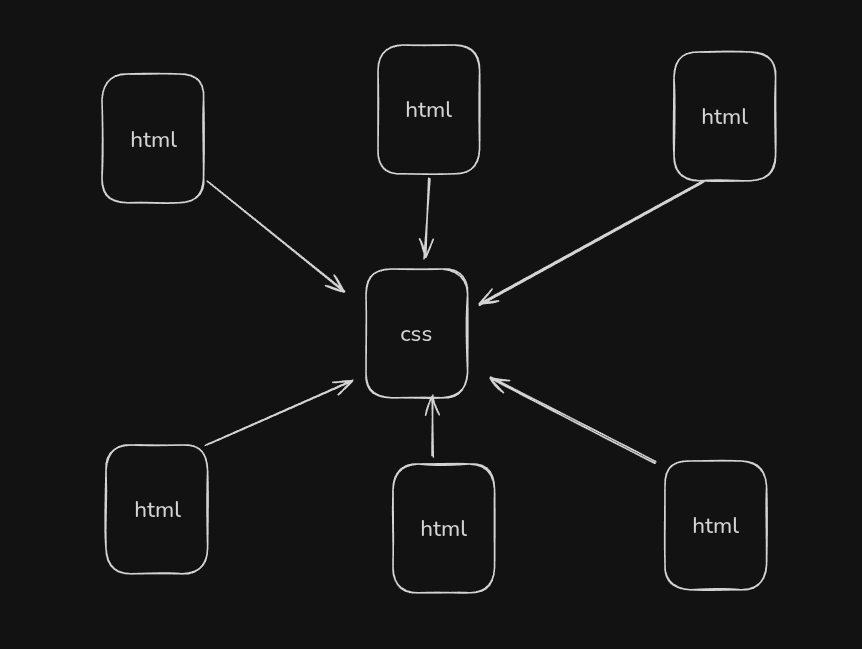

# CSS- Sumon Barai

## Day-01

- **CSS Introduction**
  - css: cascading style sheet
  - Why learn CSS
    - styling the HTML tags
    - responsive website
    - animation on a webpage
    - 2d and 3d transformation of HTML elements
    - The website development process is fast
  - One CSS file for all HTML files
  - example
    
- **CSS Implementation**
  - 3 ways to implement CSS
    - inline style == > style attribute
    - inpage / internal style tag == > style tag
    - external style sheet
- **Color & Background Color**
  ```css
  h1 {
    color: red;
    backgroud: blue;
  }
  ```
- **Css Selectors**
  **We can divide CSS selectors into 5 categories:**

  1. Simple selectors
  2. Combinator selectors
  3. Pseudo-class selectors
  4. Pseudo-elements selectors
  5. Attribute selectors

  - **1 . Simple selectors**
    - Universal Selector : \*
    - tag name selector: h1
    - class selector: .classname
    - id selector: #id-name
  - 2. Combinator selectors

    - A combinator is something that defines the relationship between two or more selectors.
    - Combinator selectors

      - Descendant combinator (space)

        ```css
        // select all p under div tag
        div p {
          background-color: yellow;
        }

        ul li.text {
          background-color: yellow;
        }

        ul li#text {
          background-color: yellow;
        }
        ```

      - Child combinator (>)
        ```css
        selects
          all
          elements
          that
          are
          direct
          children
          of
          a
          specified
          element.
          div
          > p {
          background-color: yellow;
        }
        ```
      - Next sibling combinator (+)
        ```css
        select an element that is directly after a specific element. div + p {
          background-color: yellow;
        }
        ```
      - Subsequent-sibling combinator (~)
        ```css
        selects
          all
          elements
          that
          are
          next
          siblings
          of
          a
          specified
          element.
          div
          ~ p {
          background-color: yellow;
        }
        ```

  - 3
  - 4
  - 5
