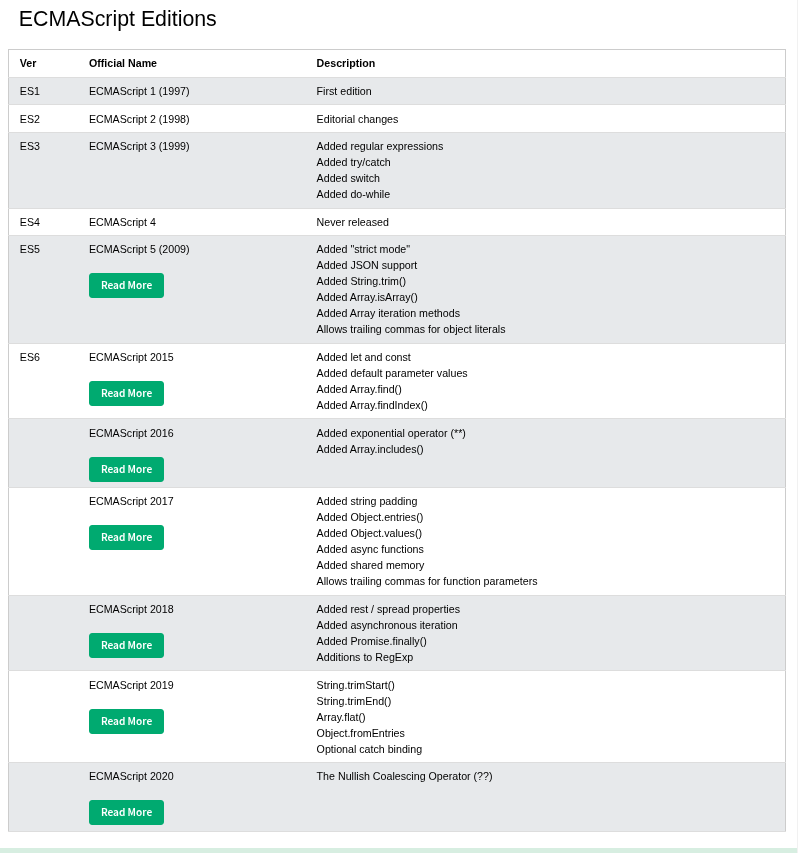

# class -01

- **what is javascript?**
  - JavaScript is a high-level, just-in-time compiled programming language that conforms to the ECMAScript specification.
  - JavaScript is a synchronous, blocking, single-threaded programming language.
  - **Synchronous**: code execution is line by line
  - **Blocking:** No matter how long a previous process takes, the subsequent processes won't kick off until the former is completed.
  - **Single-threaded.** A thread is simply a process that your JavaScript program can use to run a task.
    - Each thread can only do one task at a time.
    - JavaScript has just one thread, called the main thread, for executing any code.
- **Javascript Runtime**
  - An environment that provides all the necessary components in order to use and run a JavaScript program
  - Browser, NodeJS, and Bun are runtimes
  - The browser is written in a low-level language like C, Rust, or other
  - Node.js is primarily written in C++ language
  - Bun is written in Zig language
- **JavaScript Engine**
  - A program that converts JavaScript code we write into machine code that allows a computer to perform specific tasks
  - Every browser has a built-in JavaScript engine
  - Node.js uses Google's V8 engine that power's Chrome browser
  - Bun uses JavaScriptCore (JSC), which is an open-source JavaScript engine developed by Apple for Safari
  -
- **Two types of programming languages based on execution**
  - client-side language - JavaScript
  - server-side language -
    - JavaScript (Node.js)
    - Python (Django, Flask, FastAPI)
    - PHP (Laravel, CodeIgniter, WordPress backend)
    - Java (Spring Boot, JSP, Servlets)
    - C# (ASP.NET Core)
    - Ruby (Ruby on Rails)
    - Go (Golang)
    - Rust
    - C++ (less common, but used in high-performance servers)
- **Advantages of the JavaScript language**
  - web application
  - mobile application
  - desktop application
  - more…
- **Software requirements for learning JavaScript**
  - Code editor or IDE ( VS Code editor )
  - Runtime ( browser or Node.js)
  - VS Code extension setup
- **History of JavaScript**
  - **JavaScript** was invented by Brendan Eich in 1995, and became an **ECMA** standard in 1997. ( 10 days )
  - **ECMAScript** is the official name of the **JavaScript standard**.
  - **ECMAScript Editions**
    
- **where JS code runs and practice**
  - browser console
  - code editor
  - online code editor
- **Implementation of JavaScript code**
  - internal way
  - external way ( script in a separate file)
- **How to get output in js code**
  - innerHTML or innerText. (only browser runtime )
  - document.write(). (only browser runtime )
  - window.alert(). (only browser runtime )
  - console.log(). (node and browser runtime )
- **The difference between client-side vs server-side JS code run**
  - Browser runtime — client side
  - Node runtime — server side
  - HOT Reloading
    - live server extension
    - — watch mode in node
- **How to comment JS code**
  - single line comments
  - multiline comments
- async vs defer
  - Example
    
